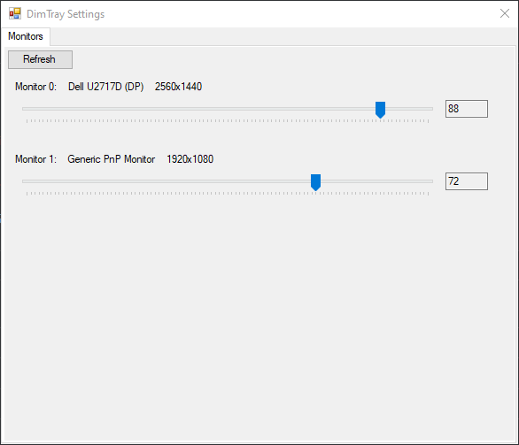
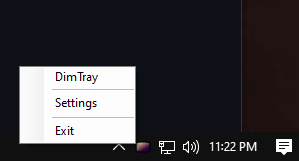

# DimTray
An application for controlling monitor backlight levels.\
Windows only. Requires .NET Framework 4.8
## Screenshots
\
The application window
\
\
\
The right click tray icon menu
## Roadmap
- [x] Control monitor backlights - present in version 0.1.0
- [ ] Save brightness settings to profiles
- [ ] Assign hotkeys to profiles
## Copyright
DimTray - Copyright (C) 2021 Bryan Rykowski\
Provided under the terms of the GNU General Public License version 3
